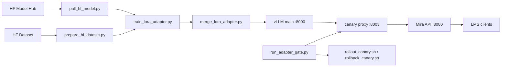

# Mira: Education LLM Infrastructure Blueprint

Mira is a backend-only reference stack for building and operating an education-focused LLM pipeline:

- OpenAI-compatible API gateway
- vLLM inference plane
- Canary proxy for safe promotion
- Hugging Face model and dataset ingestion
- H100-oriented LoRA/QLoRA fine-tuning
- Adapter merge/export and promotion gating

This repository intentionally excludes UI layers and focuses on infra + model lifecycle.

## Table of Contents

- [Overview](#overview)
- [Key Features](#key-features)
- [Software Components](#software-components)
- [Technical Diagram](#technical-diagram)
- [Minimum System Requirements](#minimum-system-requirements)
- [Getting Started](#getting-started)
- [Full Pipeline (Train to Serve)](#full-pipeline-train-to-serve)
- [Canary Rollout and Rollback](#canary-rollout-and-rollback)
- [Repository Structure](#repository-structure)
- [Security Considerations](#security-considerations)
- [Documentation](#documentation)
- [License](#license)

## Overview

Mira mirrors a production-style LLM stack where model lifecycle and backend reliability are first-class concerns.

- Runtime endpoints:
  - `POST /v1/chat/completions`
  - `POST /v1/completions`
- Operational endpoints:
  - `GET /health`
  - `GET /ready`
- Provider compatibility:
  - direct upstream OpenAI-compatible models
  - self-hosted vLLM via canary proxy

## Key Features

- OpenAI-compatible contract with strict JSON normalization for downstream LMS systems
- Guardrails on prompt size and token bounds
- Deterministic canary routing and route introspection headers
- LoRA/QLoRA adapter training and merge pipeline
- Evaluation gate to block low-quality or high-latency promotions
- Scripted rollout and rollback operations

## Software Components

| Component | Path | Role |
| --- | --- | --- |
| API service | `src/mira/api.py` | OpenAI-compatible endpoint layer |
| Provider client | `src/mira/llm_client.py` | Upstream model invocation and fallback |
| Guardrails | `src/mira/guardrails.py` | Payload policy enforcement |
| Canary proxy | `scripts/llm_canary_proxy.py` | Base-versus-canary routing and control |
| vLLM launcher | `scripts/run_vllm_server.py` | Environment-driven vLLM startup |
| Compose deployment | `deploy/compose/docker-compose.backend.yml` | vLLM + proxy + API stack |
| HF model pull | `scripts/pull_hf_model.py` | Local model snapshot sync |
| Dataset prep | `training/scripts/prepare_hf_dataset.py` | HF dataset -> chat JSONL |
| QLoRA trainer | `training/scripts/train_lora_adapter.py` | H100-oriented adapter training |
| Adapter merge | `training/scripts/merge_lora_adapter.py` | Adapter + base merge for serving |
| Promotion gate | `evaluation/run_adapter_gate.py` | Base/canary quality and latency gate |

## Technical Diagram



Full architecture notes: [docs/reference/technical_diagram.md](docs/reference/technical_diagram.md).

## Minimum System Requirements

| Profile | GPU | CPU | RAM | Disk |
| --- | --- | --- | --- | --- |
| API + proxy only | Optional | 8 vCPU | 16 GB | 50 GB |
| Local vLLM 7B serving | 1x H100 80GB (or equivalent) | 16 vCPU | 64 GB | 250 GB |
| Train + serve pipeline | 4-8x H100 80GB | 64 vCPU | 256 GB | 1 TB |

See [docs/reference/system-requirements.md](docs/reference/system-requirements.md) for details.

## Getting Started

### Option A: API-only local runtime

```bash
python -m venv .venv
source .venv/bin/activate
pip install -r requirements.txt
cp configs/app.env.example configs/app.env
bash scripts/run_local_api.sh
```

### Option B: Full backend stack (vLLM + proxy + API)

```bash
cp configs/stack.env.example configs/stack.env
scripts/start_backend_stack.sh
```

`scripts/start_backend_stack.sh` is host-aware:

- On NVIDIA-enabled hosts, it starts full GPU mode (`vLLM + proxy + API`).
- On non-NVIDIA hosts, it automatically starts fallback mode (`API only`).

Optional explicit mode override:

```bash
MIRA_START_MODE=gpu scripts/start_backend_stack.sh
MIRA_START_MODE=fallback scripts/start_backend_stack.sh
```

Guides:

- [docs/get-started/get-started-backend.md](docs/get-started/get-started-backend.md)
- [docs/get-started/get-started-h100-training.md](docs/get-started/get-started-h100-training.md)

## Full Pipeline (Train to Serve)

### 1) Pull base model from Hugging Face

```bash
python scripts/pull_hf_model.py \
  --repo-id Qwen/Qwen2.5-7B-Instruct \
  --local-dir models/base/qwen2.5-7b-instruct
```

### 2) Prepare training/eval data

```bash
python training/scripts/prepare_hf_dataset.py \
  --dataset-id TIGER-Lab/MathInstruct \
  --split train \
  --max-samples 20000 \
  --train-output training/data/edu_train.jsonl \
  --eval-output training/data/edu_eval.jsonl
```

### 3) Train LoRA/QLoRA adapter

```bash
python training/scripts/train_lora_adapter.py \
  --config-yaml training/configs/qlora_h100.yaml
```

### 4) Merge adapter for serving

```bash
python training/scripts/merge_lora_adapter.py \
  --base-model-id Qwen/Qwen2.5-7B-Instruct \
  --adapter-path training/outputs/qwen25_edu_qlora_adapter \
  --output-dir models/merged/qwen25_edu_merged
```

### 5) Run promotion gate

```bash
python evaluation/run_adapter_gate.py \
  --base-url http://127.0.0.1:8003 \
  --base-model qwen2.5-7b-instruct \
  --canary-model qwen2.5-7b-instruct-edu-lora \
  --prompts-file evaluation/prompts/sample_prompts.jsonl
```

### One-command pipeline

```bash
training/scripts/run_full_pipeline.sh
```

Set `RUN_SERVING_GATE=true` to include stack boot and promotion check in the same execution.

## Canary Rollout and Rollback

```bash
scripts/rollout_canary.sh --percent 25
scripts/rollback_canary.sh
```

## Repository Structure

```text
.
├── deploy/
│   ├── compose/
│   └── docker/
├── docs/
│   ├── get-started/
│   └── reference/
├── evaluation/
├── scripts/
├── src/mira/
└── training/
    ├── configs/
    ├── data/
    ├── outputs/
    └── scripts/
```

## Security Considerations

- Use `MIRA_API_KEY` for gateway protection.
- Keep tokens and credentials out of git.
- Treat prompts/completions in logs as sensitive data.
- Restrict service ports to private networks.

See [SECURITY.md](SECURITY.md) for policy guidance.

## Documentation

- [docs/architecture.md](docs/architecture.md)
- [docs/deployment.md](docs/deployment.md)
- [docs/governance.md](docs/governance.md)
- [docs/reference/technical_diagram.md](docs/reference/technical_diagram.md)
- [docs/reference/system-requirements.md](docs/reference/system-requirements.md)
- [docs/troubleshooting.md](docs/troubleshooting.md)

## License

MIT. See [LICENSE](LICENSE).
