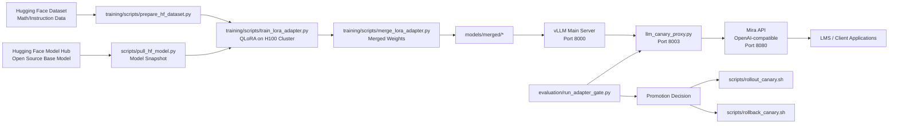

# Technical Diagram

## Notes

- vLLM is the model execution plane.
- The canary proxy controls base-versus-adapter routing percentages.
- Mira API enforces schema and guardrails while preserving OpenAI endpoint compatibility.
- Promotion gate scores quality and latency before rollout.
